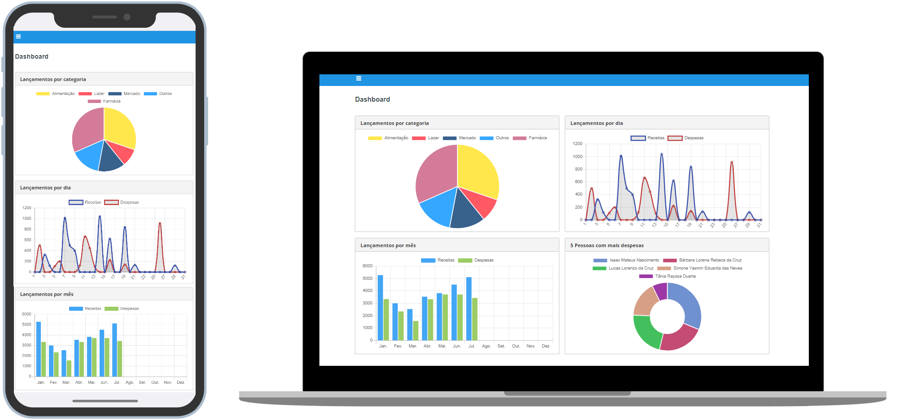

<h1 align="center">
    
</h1>

## 💻 Projeto

Front-end do projeto desenvolvido durante o curso Fullstack Angular e Spring da [AlgaWorks](https://github.com/algaworks).

Utilizado [Angular CLI ](https://github.com/angular/angular-cli) versão 10.0.1.

O repositório do back-end você encontra [aqui](https://github.com/rodrigo-lucio/curso-fullstack-angular-spring-backend).

## :rocket: Tecnologias

Neste projeto foram utilizadas as seguintes tecnologias:

- [Angular](https://angular.io/)
- [Biblioteca PrimeNG](https://www.primefaces.org/primeng-5.2.7/)
- [Deploy no AWS com EC2](https://aws.amazon.com/pt/ec2/) 
- [Docker](https://www.docker.com/)
	- 03 containers: OpenJDK, PostgreSQL e Node
- [Demonstração](http://18.234.65.57:4200/login) 
	- Usuário: demo@demo.com.br 
	- Senha: demo
	- Sinta-se a vontade 😃

## ▶️ Utilização

Dentro da pasta do projeto, execute o comando `npm install` para instalar as todas as dependências necessárias.

Após isso, execute o comando `ng serve` para iniciar a aplicação.

A projeto estará rodando em `http://localhost:4200`.

Com a API do Back-end iniciada, você poderá utilizar as seguintes credencias para acessar:

Login: admin@algamoney.com e senha: admin

Obs: Este projeto fará automaticamente o controle de busca e renovação do token [JWT](https://jwt.io/).

